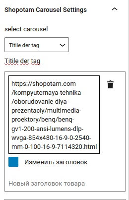
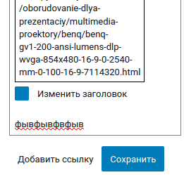

# Описание изменений

Редактирование блока вынесено из модального окна в правую панель настроек блока.

Добавлен чекбокс для изменения заголовка товара, который открывает текстовое поле с новым значением.

Добавить новый товар в карусель можно по клику "Добавить ссылку".

обратите внимение, что при редактировании блока нет автосоранения. После завершения редактирования необходимо сохранить изменения в данном блоке. Это нужно для того, чтобы сохранить изменения в карусели.
